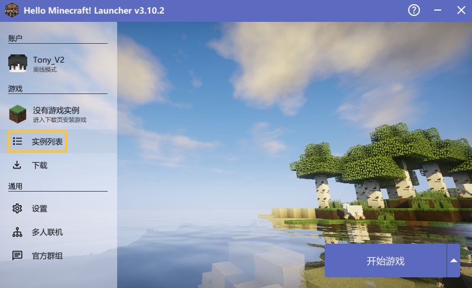
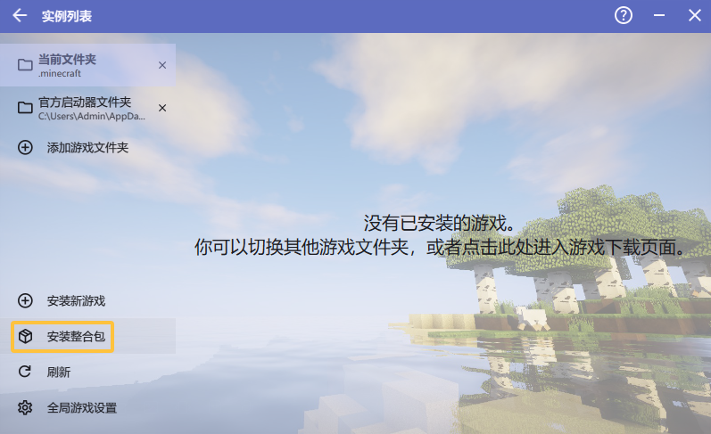
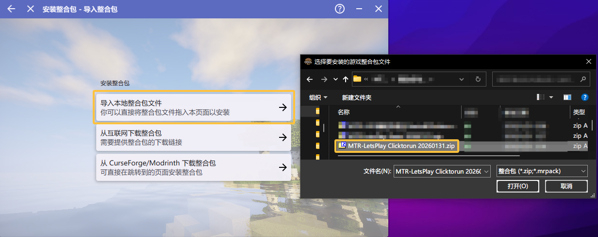
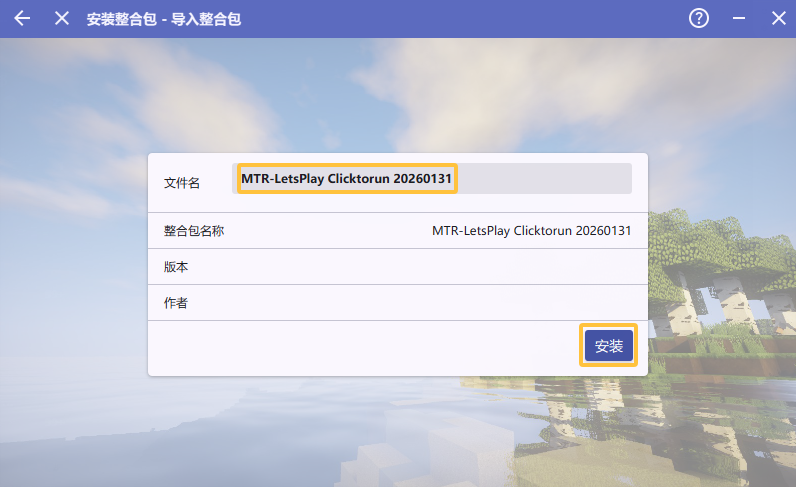
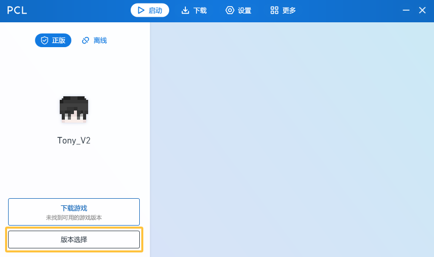

## [PDF版完整教程](https://workdrive.zohopublic.com.cn/print/lycmy2fbd8e664397437fac078ac2f3ed990e)

## 准备

- 一台至少有 **6GB 机载运行内存** 的电脑，且有至少 **4GB 内存**可以分配给 Minecraft 使用（储存空间 > 5GB）
- 一个**正版 Minecraft 账号**（不支持离线版，更不支持网易；若没有正版 Minecraft，请至 XBOX 商店购买，或订阅 XGP）
- 下载好的根据需求选择的整合包（可能还有追加包）
- 一个能够思考问题的大脑

!!! tip "关于手机"

    经测试手机可以进入此服务器，但游玩体验较差，非常不建议用手机游玩。

!!! tip "关于电脑配置"

    作为参考，以 16 区块的渲染距离和模拟距离运行 10 分钟左右能吃满分配的 24GB 内存，原因在于此服务器使用的资源包内高分辨率贴图数量较多。

!!! tip "资源选择省流"

    如果不想看资源说明，请下载 **Clicktorun** 版本的整合包；如果硬盘空间足够建议下载 **Bobby 模组的追加包**，以获得更好的游玩体验。DistantHorizons 模组对 CPU 与存储空间要求较高，建议高配电脑尝试。

## 资源下载

提取码均为 `dEqH`，所有链接不限速、无需登录。

- 主链（OneDrive——含全部资源，建议搭配多线程下载器使用）：[https://lpsresource.ooowl.net](https://lpsresource.ooowl.net)（推荐）
- OneDrive 直连（含全部资源，大陆用户可能无法访问）：[https://1drv.ms/f/c/959219da68d47a00/Eovu-Le5Y9JFtEgGSX10AwcBuAc7051FoGz_K9jf-qMHNA?e=p5DI3S](https://1drv.ms/f/c/959219da68d47a00/Eovu-Le5Y9JFtEgGSX10AwcBuAc7051FoGz_K9jf-qMHNA?e=p5DI3S)
- Zoho Workdrive（仅含 Basic、模组升级包与其他资源，下载速度快）：[https://workdrive.zohopublic.com.cn/external/e966604f12f757cfb97372be2dd6d1c22a2c8c53e79946e42252228266b8bb9a](https://workdrive.zohopublic.com.cn/external/e966604f12f757cfb97372be2dd6d1c22a2c8c53e79946e42252228266b8bb9a)

进入资源页面后，选择<kbd>整合包与追加包</kbd>。


### 整合包版本说明

| 版本 | 说明 |
| --- | --- |
| **Basic** | 仅包含进入服务器所需的所有模组（附带优化模组、一个光影包和 Slideshow 模组数据），打包体积小。不建议中国大陆地区用户下载此版本，官方资源包更新服务器位于海外，容易连接不上 |
| **Clicktorun** | 包含模组和资源包，能快速进入服务器并获得完整体验（**推荐下载**） |

### 追加包说明

以下追加包包含模组本体、配置文件与模组数据，可以按需下载：

| 追加包 | 说明 |
| --- | --- |
| **Bobby 模组与数据** | 将服务器区块以 `.mca` 格式缓存至本地，防止移动速度过快时（如乘坐高铁、飞机等）出现区块来不及加载而导致人物在虚空中运动的现象。推荐添加 |
| **DistantHorizons 模组与数据** | 通过在默认视距之外添加简化过的地形，实现更远的视野距离（最高 4096 区块）。对 CPU 与存储空间要求较高，建议高配电脑尝试 |
| **Slideshow 模组与数据** | 用于显示服务器内的贴图，其数据是缓存到本地的贴图。提供给已安装整合包的用户进行更新 |
| **Xaero 全家桶模组与数据** | 包含小地图和世界地图模组，支持路径点和大地图功能 |

!!! note "关于 MTR 4.0.0 模组升级包"

    此升级包包含进入服务器所需的所有模组（除 Bobby 和 DistantHorizons），提供给以下用户进行快捷的模组替换或添加操作：因为没有及时更新模组导致无法进入服务器的用户、从之前的 1.19.2 版本升级的用户、因为使用过时的 Packwiz 自动更新源而导致模组文件夹内被混入 1.19.2 版本模组的用户、所在的网络环境无法连接至 MultiMC 服务器导致整合包无法导入的用户。

下载带有 `Clicktorun` 字样的整合包。


## 进服教程

!!! info "阅读指引"

    - 如果您此前从未在电脑上运行过 Java 版 Minecraft，请从 **Part.1** 开始阅读
    - 如果您此前在电脑上安装过 Java 17 或以上版本，请从 **Part.2** 开始阅读
    - 如果您此前已经在使用第三方启动器（如 HMCL、PCL2、Prism Launcher 等），请从 **Part.3** 开始阅读

    具体确认方法：在 Windows 上打开命令提示符（按 `Win+R` 打开运行框，输入 `cmd` 回车）或在 MacOS 上打开终端，输入 `java -version`，如果出现版本号说明安装成功。

### Part.1 安装 Java

!!! info "为什么需要安装 Java？"

    Minecraft Java 版需要 Java 运行环境才能运行。本服务器基于 Minecraft 1.20.4，需要 **Java 17**。

1. 下载资源页面中 `其他资源` 文件夹内的 Java 17 安装包（提供 Oracle 官方版和 Adoptium Eclipse Temurin 版本，后者由 Eclipse 基金会提供社区支持，更为稳定高效且支持更多平台），并双击运行
2. 如果您看到提示已安装过 Java 17 的弹窗，请点击"否"退出安装
3. 若非必要，不建议更改 Java 17 的安装路径，可能会导致启动器无法自动识别已经安装的 Java，保持默认即可
4. 等待进度条走完，说明您已经成功安装了 Java 17

### Part.2 登录账号

下载资源页面中 `其他资源` 文件夹内的启动器（HMCL 或 PCL2），建议把启动器放在一个单独的文件夹中。这个文件夹将作为存储游戏数据的位置，请确保此文件夹所在的驱动器有足够空间。

!!! note "关于启动器选择"

    官方启动器由于无法自动安装整合包，无法使用。推荐使用 HMCL 或 PCL2。

=== "HMCL"

    1. 双击打开启动器，点击左上角的"没有游戏账户，点击此处添加账户"
    2. 点击"微软账户"
    3. 点击"登录"，此时一串代码会自动复制到您的剪贴板，同时跳出一个浏览器窗口
    4. 将代码粘贴到输入框中，点击"允许访问"
    5. 如果浏览器内没有登录您的微软账号，请登录
    6. 登录完毕后，回到主界面，您应该看到您的头像与 ID 显示在"账户"一栏中

=== "PCL2"

    1. 双击打开启动器，点击"账户"选项卡
    2. 点击"添加账户"，选择"微软账户"
    3. 按照提示完成微软账号的登录授权
    4. 登录成功后，回到主界面确认账户信息显示正常

### Part.3 安装整合包

!!! important "版本隔离设置"

    虽然整合包会强制开启版本隔离，但为了管理方便和避免出现不必要的麻烦，请先在全局设置里更改版本隔离设置为"各版本独立"。

=== "Prism Launcher"

    打开 Prism Launcher，点击<kbd>添加实例</kbd>

    

    依次点击<kbd>导入</kbd>→<kbd>浏览</kbd>

    

    选择您刚刚下载好的包导入，并点击<kbd>确定</kbd>进入下一步。

    稍等片刻，整合包将自动导入完成。

    

    如果 MacOS 用户安装时遇到报错，请用压缩软件打开整合包，检查 `.minecraft` 文件夹内是否含有 `icon.png`，若有，请删去，然后重试导入。

=== "HMCL"

    打开 HMCL，点击<kbd>实例列表</kbd>

    

    点击<kbd>安装整合包</kbd>

    

    点击<kbd>导入本地整合包文件</kbd>，选择刚刚下载好的包，点击<kbd>打开</kbd>

    或者直接将整合包文件拖入启动器窗口中

    

    在文件名一栏中，可以按个人喜好修改版本名称，这会影响启动器内该版本的显示名称与游戏版本文件夹的名称

    核对整合包信息无误后，点击<kbd>安装</kbd>

    

    稍等片刻，整合包将自动导入完成

    

    如果 MacOS 用户安装时遇到报错，请用压缩软件打开整合包，检查 `.minecraft` 文件夹内是否含有 `icon.png`，若有，请删去，然后重试导入。

=== "PCL2"

    打开 PCL2，点击<kbd>版本选择</kbd>

    

    点击<kbd>导入整合包</kbd>，选择刚刚下载好的包，点击<kbd>打开</kbd>

    或者直接将整合包文件拖入启动器窗口中

    

    按个人喜好填写版本名称，这会影响启动器内该版本的显示名称与游戏版本文件夹的名称

    填写完毕后点击<kbd>安装</kbd>

    

    稍等片刻，整合包将自动导入完成

    

### Part.4 启动前设置

导入整合包后，进入版本管理界面，根据电脑情况调整以下设置：

- **内存分配**：进入游戏至少需要 **4GB**（注意：分配的内存不能超出实际可用的物理内存的大小，否则会报错）
- **进程优先级**：电脑配置低就调高一些
- **启动器可见性**：根据个人喜好调整

!!! tip "导入追加包"

    如果您下载了可选模组的追加包，请在这一步导入，可参阅[追加包导入教程](#part6-追加包导入教程)。

### Part.5 启动游戏

点击启动游戏后，会加载出模组同步程序（Packwiz-installer），此时请不要操作，将会自动下载/更新所需模组。


#### Packwiz-installer 模组自动更新

Packwiz-installer 用于模组的自动更新，此时根据网络情况的不同，会出现以下情况：

!!! success "情况 1：提示"重新配置可选模组"或显示"模组包已经是最新版本""

    如果您想要检查更新（建议），点击"继续"或等待倒计时结束。如果您不想要检查更新（不建议，可能会导致客户端与服务端模组不匹配而无法进服），在继续的 10 秒倒计时结束前点击"取消"，在弹出的窗口中点击"忽略"。

!!! warning "情况 2：一直卡在"载入模组包文件""

    点击"取消"，跳至情况 3。

!!! warning "情况 3：直接提示"HTTP 请求失败""

    点击"在不更新的情况下继续"。

模组自动同步完毕后，将会弹出游戏窗口，此时资源同步实用程序（Resource Pack Updator Utility 模组，简称 RPU）会自动下载服务器所需资源包，请耐心等待。


!!! tip "资源包更新速度慢？"

    如果您感觉更新速度慢，可能是连接官方源速度较慢，请参阅[常见问题解答](#问题-8资源同步实用程序界面报错资源包更新速度慢)换用镜像源。

!!! warning "加载界面提示"未响应""

    如果您的电脑配置较低，此加载界面可能持续较长时间，并提示"未响应"，这是正常现象，请耐心等待，不要结束进程。

完成之后您可能会看到如下界面且可能为英文，请按照下方图片操作：


!!! tip "按键冲突提示"

    由于 Z 键是 MTR 模组默认的电梯选层按钮和 Xaero MiniMap 默认的小地图放大按钮，建议您进入游戏后先修改此冲突键位。

### Part.6 追加包导入教程

以 Bobby 模组与数据为例，下载后解压，选中全部的 3 个文件夹，直接拖入或复制/剪切至游戏版本根目录内（默认为启动器同级目录下 `.minecraft/versions/MTR-LetsPlay[整合包版本]`），您应该看到 `mods` 和 `config` 文件夹自动与根目录内已有的文件夹合并。

如果您已经安装过 Bobby 模组，只想要模组数据，直接复制 `.bobby` 文件夹至游戏版本根目录下即可（同理，DistantHorizons 模组复制 `Distant_Horizons_server_data` 文件夹，Slideshow 模组复制 `slideshow` 文件夹，Xaero 全家桶复制 `xaero` 文件夹）。

在再次启动游戏之前，建议您检查一遍 `mods` 文件夹内有没有对应的模组，根目录下有没有模组所需的数据，以防止出现启动问题。

!!! note "从旧版 Xaero 迁移"

    新版 Xaero 全家桶将两个模组的数据整合在了同一个文件夹中，而旧版则是分为 `XaeroWaypoints` 和 `XaeroWorldMap` 两个文件夹。如果您是旧版整合包用户，要使用追加包，请您把 `mods` 文件夹里的两个旧版本 Xaero 模组以及根目录下的 `XaeroWorldMap` 文件夹删除，再导入追加包。若您想要保留路径点，请暂时保留 `XaeroWaypoints` 文件夹，添加追加包后，删除 `xaero/minimap/Multiplayer_[服务器IP]` 内的所有文件，将原文件夹内的内容移动到这一文件夹，之后您可以删除旧的空 `XaeroWaypoints` 文件夹。

## 服务器IP

完成后点击多人游戏，请畅快开玩！

这里附上多人游戏内不同服务器选项所对应地址。


!!! important "防火墙提示"

    对于第一次进入"多人游戏"界面的用户，您可能会遇到防火墙安全警报，建议您将"专用网络"和"公用网络"都勾选上，并点击"允许访问"，以避免网络连接问题。Windows 11 用户如果没有看到复选框，请点击"显示更多"。

### 官方IP

适用于海外玩家/北方移动，延迟可能较高。

- **IP 地址**：`letsplay.minecrafttransitrailway.com`
- **端口**：`25565`

#### 测试服IP

- **IP 地址**：`135.148.15.1`
- **端口**：`26888`

!!! note "关于测试服"

    旧 IP 在官服从 MTR 3.2 升级至 4.0 时被用作测试服，包含官服当时的一版地图备份以及另一个知名 MTR 服务器：岑城 Centown 的地图，现在仍然可以进入。

### 加速IP

此连接地址由文档维护成员[@MZDYHR](https://github.com/MZDYHR)提供，适用于境内/中国香港地区链接。

- **IP 地址**：`mc.lnlfly.com`
- **端口**：`25565`

如果想要支持该加速地址的运营，请见[赞助](../about/sponsorship.md)

此连接地址由社区成员@Darkli提供，适用于南方/中国香港地区链接。

- **IP 地址**：`154.44.26.51`
- **端口**：`25565`

#### 测试服加速IP

此连接地址由文档维护成员[@MZDYHR](https://github.com/MZDYHR)提供，适用于境内/中国香港地区链接。

- **IP 地址**：`mtrtest.lnlfly.com`
- **端口**：`25565`

如果想要支持该加速地址的运营，请见[赞助](../about/sponsorship.md)

!!! tip "加速 IP 选择建议"

    一般情况下，中国大陆地区用户请选择加速 IP（`mc.lnlfly.com`）以获得更低延迟和更好体验。注意加速 IP 与加速器不要同时使用。

!!! tip "加速 IP 失效怎么办"

    若加速 IP 失效，请到[社区服务状态监控](https://status.ooowl.net/status/mtrlps)页面查找可用的 IP 进行替换，绿色即为可用。

## 更换 IP 时数据文件夹说明

!!! important

    如果您更换了使用的 IP（如从官服 IP 切换到加速 IP），部分模组的数据文件夹名称需要相应更改，否则模组将会无视已有数据而重新缓存，降低游戏体验的同时占用存储空间。

| 模组 | 数据文件夹 | 命名规则 | 示例（官服 IP） | 示例（加速 IP） |
| --- | --- | --- | --- | --- |
| **Bobby** | `.bobby/` | 以服务器 IP 命名 | `letsplay.minecrafttransitrailway.com` | `mc.lnlfly.com` |
| **Distant Horizons** | `Distant_Horizons_server_data/` | 以多人游戏服务器列表内的服务器名称命名 | `MTR+Let%27s+Play+New` | `MTR+Let%27s+Play+New+Boost+3` |
| **Xaero 系列**（旧版） | `xaero/minimap/` 和 `xaero/world-map/` | 以 `Multiplayer_[服务器IP]` 命名 | `Multiplayer_letsplay.minecrafttransitrailway.com` | `Multiplayer_mc.lnlfly.com` |

!!! note "新版 Xaero（20260212 及以后版本）"

    如果您使用的是 20260212 及以后版本的整合包，则更换 IP 时无需再更改 Xaero 系列数据文件夹的名称，因为配置文件中的 `differentiate_by_server_address` 参数将会使所有多人游戏服务器共用同一个数据文件夹（名称变为 `Multiplayer_Any Address`）。

!!! note "转义字符说明"

    Distant Horizons 的服务器名称中，空格为 `+` 号，撇号为 `%27`。如果您自行更改了多人游戏服务器列表内的服务器名称，请根据更改的名称对应修改数据文件夹名称。

## 整合包内文件说明

| 文件夹 | 说明 |
| --- | --- |
| `.bobby/` | Bobby 模组的区块缓存数据（若未安装 Bobby 模组则没有此文件夹） |
| `config/` | 模组配置文件（Clicktorun 版没有 Bobby 和 DistantHorizons 的配置文件） |
| `Distant_Horizons_server_data/` | DistantHorizons 模组的数据（Clicktorun 和 Standard 版没有此文件夹） |
| `mods/` | 模组文件 |
| `resourcepacks/` | 自动同步资源包（SyncedPack） |
| `shaderpacks/` | 光影包 |
| `slideshow/` | Slideshow 模组下载到本地的贴图文件 |
| `xaero/` | Xaero's Minimap 和 Xaero's World Map 的数据 |

## 常见问题解答

### 问题 1：经常丢失连接/无法移动或瞬移

这些都是网络延迟问题的表现，通常只有在使用官服 IP 连接时才会出现。

1. 换用[加速 IP](#加速ip)（最方便的方法）
2. 使用加速器的欧洲节点进行加速（效果因选用的加速器而异）
3. 换用手机移动数据热点连接（效果与所在区域以及运营商有关）

### 问题 2：进服后帧数很低

1. 确保您分配了尽量多的内存
2. 按 `Esc` 暂停，依次点击"选项"→"视频设置"
3. 向左拖动滑块，调低"渲染距离"、"最大阴影距离"、"模拟距离"三项参数
4. 点击"垂直同步"调至"关闭"
5. 向右拖动到底"最大帧率"滑块至"无限制"

### 问题 3：进服后区块加载慢

1. 确保您分配了尽量多的内存
2. 如果您没有安装 Bobby 模组，可以下载 Bobby 模组的追加包，能较大程度地缓解这一情况
3. 经过没有缓存过的区块时加载仍然较慢，更大的可能性是服务器本身的性能问题，无法避免

### 问题 4：游戏启动时/进入世界时卡死

耐心等待即可，不要结束进程。

### 问题 5：进服后看不到 MTR 模组线路图和指示牌

可能是网络延迟过高的问题（见[问题 1](#问题-1经常丢失连接无法移动或瞬移)）以及光影兼容性问题。关掉光影即可，在游戏内按 `O` 键可快速打开光影设置。

### 问题 6：Slideshow 模组的贴图显示为裂开的图片

出现此现象说明您的网络环境无法连接至这些图片所在的图床，属于正常现象，不影响游玩。如果您想要加载出贴图，请使用 VPN 进行尝试：打开 VPN 软件的全局+TUN 模式；或进入模组菜单中的 Slideshow 模组设置，启用"网络代理"，并将端口号设置为 VPN 软件的端口（例如 Clash 默认为 7890）。两种方法二选一即可。

### 问题 7：加入服务器时提示"接收到 XX 个本客户端未知的注册表项"

这通常是由于您使用的 MTR 模组（及其附属模组）的版本与服务器的版本不匹配所导致的，说明模组自动更新程序没有正常工作，您需要手动将对应的模组更新至最新版本，才能正常进服。

**模组自动更新程序（Packwiz-installer）基本工作原理**：Packwiz-installer 将会访问存放着模组的 Git 仓库，并核对远端和本地的模组是否匹配，若不匹配则会自动下载需要更新的模组。

**手动更新方法**：

1. 前往存放模组的 Git 仓库下载需要更新的模组（推荐，最保险）
    - 官方仓库：`https://github.com/Minecraft-Transit-Railway/LetsPlay-Packwiz/tree/master/mods`
    - 镜像仓库（推荐）：`https://gitea.dusays.com/fenychn0206/LetsPlay-Packwiz/src/branch/master/mods`
2. 如果是 `.jar` 文件，可以直接下载，然后放到 `mods` 文件夹，并手动删除旧版本
3. 如果是 `.pw.toml` 文件，需要找到该模组的元数据文件内指定的 url，将链接复制到浏览器中打开即可下载
4. 也可以直接去 Modrinth（Curseforge 通常也可）平台上搜索并下载需要更新的模组的最新版本

**模组类名与发布名称对照表**：

| 类名 | 发布名称 |
| --- | --- |
| `mtr` | [MTR] Minecraft Transit Railway（MTR 模组本体） |
| `londonunderground` | [LU] 伦敦地铁 MTR London Underground Addon |
| `jsblock` | [JCM] 常磐装饰 Joban Client Mod |
| `msd` | [MSD] MTR 车站装饰 Station Decoration |
| `russianmetro` | [RM] 俄罗斯地铁 Russian Metro Addon |

### 问题 8：资源同步实用程序界面报错/资源包更新速度慢

!!! info "镜像源"

    [Proxy(Japan CDN)] 速度相对较慢，作为备份。默认下载源为官方源，您需要更换 RPU 的下载源为镜像源。

**方法一**：关闭游戏窗口，重新启动一次游戏。待 RPU 界面出现后，直接按 `Esc`，调出下载源选择界面（使用 `W` 键或方向上键选择上一个，`S` 键或方向下键选择下一个，`Enter` 键确认），选择"Proxy (Aliyun Hangzhou)"将下载源切换为镜像源。

**方法二**：按 `Enter` 暂时禁用资源包，进入主界面，点击"模组"，进入模组菜单。在列表中找到"ResourcePack Updator Utility"，点击"配置"图标。点击 SourceServers 中的"Proxy(Aliyun Hangzhou)"将下载源切换为镜像源，然后点击"Update & Reload"。

若仍然不行（小概率），使用 VPN 或手机移动网络热点重试。

!!! warning "关于禁用资源包"

    如果实在无法更新，您可以选择禁用资源包进服，但**非常不建议**。资源包内存储了服务器内绝大部分的列车模型与音效，现在服务器已经升级到了 MTR 4.0 版本，如果您没有资源包，将无法乘坐资源包内的所有列车，会对游戏体验产生很大影响。

### 问题 9：启动游戏时弹窗报错"Could not create the Java Virtual Machine."

出现此问题是因为 JVM 参数头部的设置出现了问题，有可能是启动器在导入整合包时对参数进行了错误的转义，或是直接忽略了参数，导致启动时无法正确运行 Packwiz-installer 程序。

**JVM 参数头部原文**：

```
-javaagent:packwiz-installer-bootstrap-wrapper.jar=https://gitea.dusays.com/fenychn0206/LetsPlay-Packwiz/raw/branch/master/pack.toml
```

=== "HMCL"

    1. 点击"实例管理"
    2. 在"游戏设置"选项卡内下滑到底部，点击"编辑高级设置"
    3. 将 JVM 参数头部内所有内容删除，使用上方的参数头部原文替换

=== "PCL2"

    1. 点击"版本设置"
    2. 点击"设置"选项卡
    3. 展开"高级启动设置"
    4. 将 JVM 参数头部内所有内容删除，使用上方的参数头部原文替换

如果仍然报错，同时您认为您不需要 Packwiz-installer，请直接删除"JVM 参数头部"中的所有内容（**不建议**，禁用后自动更新将失效，容易导致[问题 7](#问题-7加入服务器时提示接收到-xx-个本客户端未知的注册表项)而无法进服）。

### 问题 10：启动游戏时出现 Packwiz-installer 相关报错

出现这些报错，说明您的 Packwiz-installer 文件有缺失，请打开游戏版本根目录，确保以下三个文件均存在，缺少任意一个都会导致报错：

- `packwiz-installer.jar`
- `packwiz-installer-bootstrap.jar`
- `packwiz-installer-bootstrap-wrapper.jar`

您可以用压缩软件的文件管理器打开整合包，在 `.minecraft` 文件夹内找到这三个文件。

### 问题 11：如何禁用 Packwiz-installer / 不想要每次启动时都弹出自动更新窗口

**不建议禁用**，此程序负责模组的自动更新，以确保客户端与服务端的模组匹配；禁用后自动更新将失效，容易导致[问题 7](#问题-7加入服务器时提示接收到-xx-个本客户端未知的注册表项)而无法进服。

如果您执意要禁用，按照[问题 9](#问题-9启动游戏时弹窗报错could-not-create-the-java-virtual-machine)中的方法，删除 JVM 参数头部即可，删除后 Packwiz-installer 窗口启动时不会再出现。

### 问题 12：启动游戏时闪退并出现 Resource Pack Updator Utility 模组相关报错

此问题通常是由于游戏版本根目录下 `config` 文件夹中的 `resourcepackupdater.json` 被意外覆写或删除后还原至默认配置，同时您所在地区的网络防火墙拦截了资源包更新服务器的 IP 地址，导致 RPU 无法从官方源获取到资源包的元数据而报错，进而导致游戏闪退。

**解决办法**：用文本编辑器（如 Windows 记事本）打开 `resourcepackupdater.json`，将其中已有的内容删去，替换为以下内容：

```json
{"version":2,"remoteConfigUrl":"https://gitea.dusays.com/fenychn0206/lps-community-guide/raw/branch/main/docs/assets/gameresources/client_config.json"}
```

接着启动游戏，应该自动进入下载源选择界面（使用 `W` 键或方向上键选择上一个，`S` 键或方向下键选择下一个，`Enter` 键确认），选择"Proxy (Aliyun Hangzhou)"将下载源切换为镜像源。

**检验方法**：使用浏览器访问以下地址，如果能够加载出远端配置文件内容，说明可以获取对应下载源的资源包元数据：

- 镜像源：`https://gitea.dusays.com/fenychn0206/lps-community-guide/raw/branch/main/docs/assets/gameresources/client_config.json`
- 官方源：`https://mc.zbx1425.cn/jlp-rp4/client_config.json`

### 问题 13：启动游戏时一直卡在红色 Mojang 读条界面

可能是游戏分配的内存过少所致，请确保最少分配了 **4GB（4096MB）** 内存给 MC 使用。如果可用内存不足，请尽量关闭其他无用程序，或使用虚拟内存。

### 问题 14：服务器内能建造吗

不能，所有 Visitor（参观者）默认为冒险模式。在服内建造需要成为 Builder（建造者），该职位实行邀请制，只能经由现任 Builder 推荐才有机会担任，而且目前 Builder 团队接近饱和，短期内没有招新计划。

如果想增加成为 Builder 的机会，需要在官方 Discord 上活跃，以吸引现任 Builder，并有一定的建筑水平与规划能力。

## 连接地址常见问题

### 加速 IP 和官方 IP 有什么区别？

- 官方 IP：服务器的官方地址，稳定性高，但延迟和丢包率也较高
- 加速 IP：经过优化的备用地址，可能提供更低的延迟。

### 我应该使用加速 IP 还是官方 IP？

- 如果官方 IP 连接正常且延迟可接受，可以继续使用官方 IP
- 如果官方 IP 延迟较高或不稳定，建议尝试加速 IP
- 可以将多个 IP 都添加到服务器列表，根据需要切换

### 加速 IP 无法连接怎么办？

1. 检查客户端版本是否匹配
2. 尝试其他加速 IP 节点
3. 使用官方 IP 连接
4. 检查网络连接

### 加速 IP 会定期更换吗？

- 加速 IP 地址通常保持稳定，不会频繁更换
- 如有变更，会在公告中通知

### 使用加速 IP 需要额外配置吗？

- 通常不需要额外配置，直接使用 IP 地址和端口即可
- 某些情况下可能需要配置代理，请参考相关教程

### 加速 IP 安全吗？

- 虽然加速 IP 由个人服务器提供，安全性没有保障，但这只是一个流量转发服务，盗不了你号，担心某些恶意 MOD 的攻击比这重要多了
- 同时，也请不要使用来源不明的 IP 地址，以防账号安全问题
